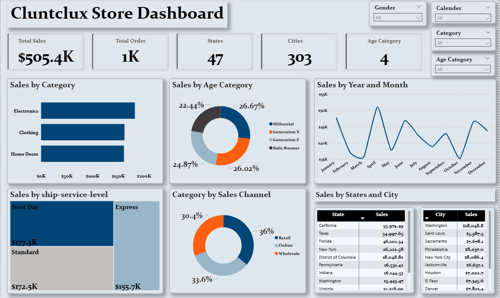

# 🛍 Retail Sales Analysis Dashboard

## 📌 Project Overview
This project analyzes *Retail Sales Data* to uncover insights into sales performance across product categories, customer demographics, shipping levels, and regions.  

The project workflow covered:
- *Data Cleaning* using Excel  
- *Exploratory Data Analysis (EDA)* with SQL  
- *Dashboard Visualization* with Power BI  
- *Business Insights & Recommendations* documented in a report  

---

## 🛠 Tools Used
- *Excel* → Data cleaning, preprocessing  
- *SQL* → Querying key business metrics (monthly sales, top customers, regional performance)  
- *Power BI* → Interactive dashboard creation & visualization  
- *GitHub* → Portfolio presentation  

---

## 📊 Key Insights
- *Total Sales:* $505.4K across 1,000 orders  
- *Top Category:* Clothing ($162K revenue)  
- *Top Age Group:* Millennials (26.7% of sales)  
- *Top States:* Georgia, Virginia, Washington  
- *Top Shipping Method:* Next Day delivery ($177.3K revenue)  

---

---

## 📸 Dashboard Preview

---

## 📑 Report
The full report with methodology, findings, and recommendations is available here:  
👉 [Retail Sales Report (PDF)](Report/Retail_Sales_Report.pdf)

---
## 🗄 SQL Analysis

This project also includes an *SQL script* (SQL/retail_sales_analysis.sql) used to analyze the dataset.  
It covers key business questions such as:  

- ✅ Total sales amount & number of orders  
- ✅ Total sales by product category  
- ✅ Monthly sales trends (year-wise)  
- ✅ Orders breakdown by shipping state  
- ✅ Average order amount by sales channel  
- ✅ Top 5 cities with highest sales  
- ✅ Customer-based purchase trends (by gender & age category)  
- ✅ B2B vs B2C sales performance  
- ✅ Return rate by product category  

These queries demonstrate my ability to *extract insights directly from raw data* before visualization in Power BI.

## 🚀 How to Use
1. Download the cleaned dataset from the Data folder.  
2. Run SQL scripts from the SQL folder to reproduce KPIs.  
3. Open sales_dashboard.pbix in Power BI to explore the dashboard interactively.  
4. Read the PDF report for business insights.  

---

## 🔗 Connect With Me
- [LinkedIn](https://www.linkedin.com/in/toluwalase-amusan-875566233)  
- [Portfolio GitHub](https://github.com/) (More projects coming soon 🚀)

